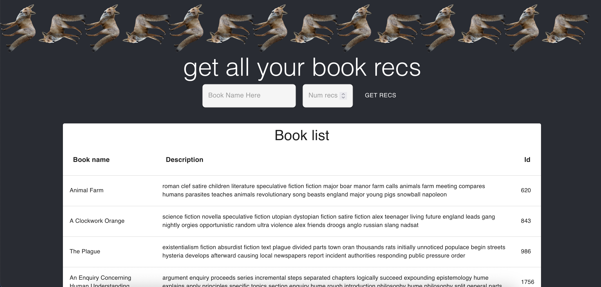

# NLP-Based Book recommender
This project uses a TF-IDF vectorizer and cosine similarity to calculate semantic similarity between book descriptions to provide book recommendations based on content similarity. K-Means clustering is used to reduce computational overhead of book comparisons (only books in the same cluster are compared). Jaro scores are used to choose the closest target book as reference if a given query isn't an entry in the book data csv.

